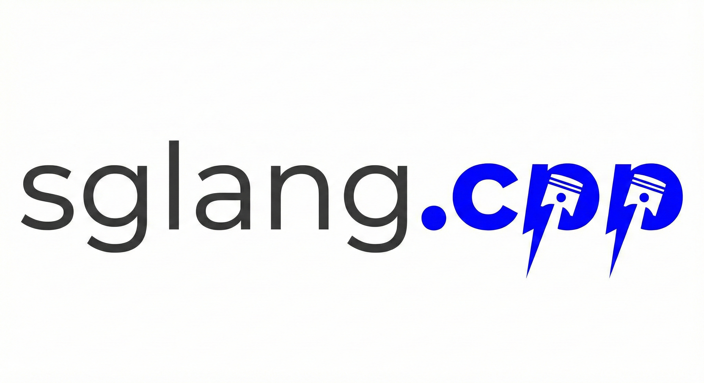

# sglang.cpp

<p align="center">
  
</p>

[中文说明 / Chinese README](docs/zh/README_cn.md)

`sglang.cpp` is a C++ reimplementation of [mini-sglang](https://github.com/sgl-project/mini-sglang). It keeps the high-level architecture aligned where practical, while using LibTorch, CUDA, and C++ multi-threading to build a lower-latency inference runtime and HTTP service.

The project currently supports:

- Single-process, single-GPU inference
- `Engine + Scheduler` request orchestration
- Offline `LLM` API
- `Cinatra`-based HTTP server
- `/generate` in non-streaming and streaming modes
- `/v1/chat/completions` in non-streaming and streaming modes
- Structured `messages` input with tokenizer-level chat-template handling

## Status

Implemented and validated so far:

- Core model runtime for `Llama`, `Qwen`, `Qwen3`, `Mistral`, and `Qwen3MoE`
- Control plane components: `Req`, `Batch`, `Engine`, `Scheduler`
- Resource management: KV cache, prefix cache, paged request/table management
- Interface layer: `ServerArgs`, `FrontendManager`, `SchedulerRunner`, `TokenizerWorkerPool`, `LLM`, `ApiServer`
- Real HTTP streaming with chunked SSE responses through `Cinatra`
- End-to-end tests using a real `Qwen/Qwen3-0.6B` model

Current focus and limits:

- Primary target is single-node, single-GPU execution
- Main real-model validation currently uses `Qwen/Qwen3-0.6B`
- Sampling support is centered on `temperature`, `top_k`, `top_p`, `ignore_eos`, and `max_tokens/max_new_tokens`
- Some API fields are accepted for compatibility with `mini-sglang`, but not all of them are fully wired through the backend yet

## Project Layout

```text
sglang.cpp/
├── CMakeLists.txt
├── include/sglang/
│   ├── core/
│   ├── engine/
│   ├── scheduler/
│   ├── models/
│   ├── tokenizer/
│   ├── llm/
│   └── server/
├── src/
│   ├── core/
│   ├── engine/
│   ├── scheduler/
│   ├── models/
│   ├── tokenizer/
│   ├── llm/
│   ├── server/
│   └── main.cpp
├── tests/
└── docs/
```

More design and planning details:

- [Design (Chinese)](docs/DESIGN_zh.md)
- [Development Plan (Chinese)](docs/DEVELOPMENT_PLAN.md)

## Dependencies

Main dependencies used by the project:

- LibTorch
- CUDA
- [Cinatra](https://github.com/qicosmos/cinatra)
- [tokenizers-cpp](https://github.com/mlc-ai/tokenizers-cpp)
- [nlohmann/json](https://github.com/nlohmann/json)
- GTest

Some dependencies are fetched via `FetchContent`.

## Build

```bash
cmake -S . -B build -DFETCHCONTENT_UPDATES_DISCONNECTED=ON
cmake --build build -j4
```

Important binaries after build:

- `build/sglang_server`
- selected test binaries such as:
  - `build/test_scheduler_e2e`
  - `build/test_llm`
  - `build/test_http_e2e`

## Model Setup

The main validated model right now is `Qwen/Qwen3-0.6B`. You can point tests and runtime to it with:

```bash
export QWEN3_MODEL_PATH=/path/to/Qwen3-0.6B
```

If this is not set, tests try to find the model from the local Hugging Face cache:

```text
~/.cache/huggingface/hub/models--Qwen--Qwen3-0.6B/snapshots/...
```

## Start the HTTP Server

```bash
./build/sglang_server \
  --model-path /path/to/Qwen3-0.6B \
  --host 127.0.0.1 \
  --port 1919 \
  --dtype bfloat16 \
  --max-running-requests 4 \
  --max-prefill-length 128 \
  --memory-ratio 0.2
```

For quick pipeline validation, you can also use dummy weights:

```bash
./build/sglang_server \
  --model-path /path/to/Qwen3-0.6B \
  --host 127.0.0.1 \
  --port 1919 \
  --dummy-weight
```

## Shell Mode

The project also supports a local interactive mode:

```bash
./build/sglang_server \
  --model-path /path/to/Qwen3-0.6B \
  --shell-mode
```

Type prompts directly and use `/exit` to quit.

## HTTP APIs

### `/generate`

Non-streaming:

```bash
curl -X POST http://127.0.0.1:1919/generate \
  -H "Content-Type: application/json" \
  -d '{
    "prompt": "Question: What is the capital of France?\nAnswer in one short sentence.",
    "max_tokens": 24,
    "ignore_eos": false,
    "stream": false
  }'
```

Streaming:

```bash
curl -N -X POST http://127.0.0.1:1919/generate \
  -H "Content-Type: application/json" \
  -d '{
    "prompt": "Question: What is the capital of France?\nAnswer in one short sentence.",
    "max_tokens": 24,
    "ignore_eos": false,
    "stream": true
  }'
```

### `/v1/chat/completions`

Non-streaming:

```bash
curl -X POST http://127.0.0.1:1919/v1/chat/completions \
  -H "Content-Type: application/json" \
  -d '{
    "model": "Qwen3-0.6B",
    "messages": [
      {"role": "system", "content": "You are a concise assistant."},
      {"role": "user", "content": "What is the capital of France? Answer in one short sentence."}
    ],
    "temperature": 0.0,
    "top_k": -1,
    "top_p": 1.0,
    "max_tokens": 24,
    "stream": false
  }'
```

Streaming:

```bash
curl -N -X POST http://127.0.0.1:1919/v1/chat/completions \
  -H "Content-Type: application/json" \
  -d '{
    "model": "Qwen3-0.6B",
    "messages": [
      {"role": "system", "content": "You are a concise assistant."},
      {"role": "user", "content": "What is the capital of France? Answer in one short sentence."}
    ],
    "temperature": 0.0,
    "top_k": -1,
    "top_p": 1.0,
    "max_tokens": 24,
    "stream": true
  }'
```

### `/v1/models`

```bash
curl http://127.0.0.1:1919/v1/models
```

## Offline LLM API

An offline `LLM` API is already available at:

- `include/sglang/llm/llm.h`

This is useful for in-process inference, scripted usage, and non-HTTP integration tests.

## Validated Tests

The following important test groups are already in place:

- `test_scheduler_e2e`
  - single-request
  - multi-request
  - abort handling
  - chunked prefill
  - prefix cache reuse
  - real-model France/Germany question-answering
- `test_llm`
  - offline `LLM` with dummy weights
  - real-model France-capital validation
- `test_http_e2e`
  - `/generate` non-streaming
  - `/generate` streaming
  - `/v1/chat/completions` non-streaming
  - `/v1/chat/completions` streaming

Run examples:

```bash
./build/test_scheduler_e2e
./build/test_llm
./build/test_http_e2e
```

## Relation to `mini-sglang`

This project follows `mini-sglang` conceptually, but makes several C++-oriented adjustments:

- Python multi-process + ZMQ is replaced, for now, by a single-process multi-threaded design
- HTTP serving is built on `Cinatra`
- tokenizer / detokenizer / scheduler cooperate in-process instead of via child processes
- `/v1/chat/completions` keeps structured `messages` and performs chat-template rendering inside the tokenizer layer

## Next Steps

Likely future work includes:

- broader OpenAI-compatible field support
- more model coverage and weight-compatibility validation
- multi-request HTTP concurrency E2E tests
- stronger streaming regression tests
- multi-GPU / distributed execution

For roadmap details, see:

- [docs/DEVELOPMENT_PLAN.md](docs/DEVELOPMENT_PLAN.md)
- [docs/DESIGN_zh.md](docs/DESIGN_zh.md)
